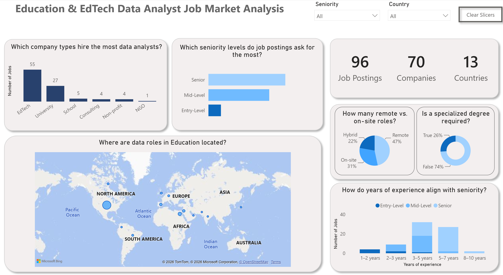
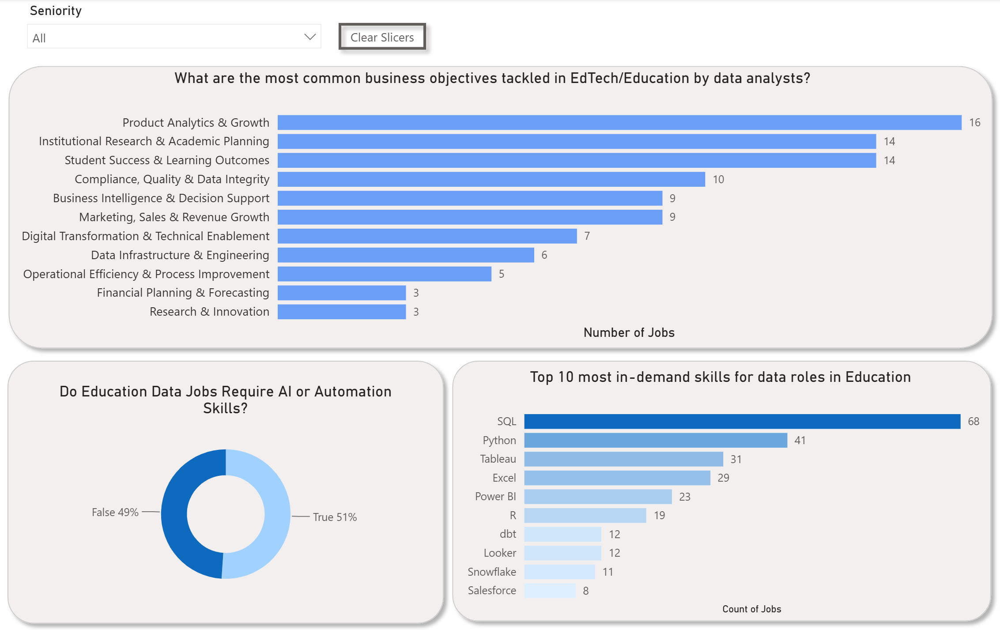

# EdTech & Education Job Market Analysis w/ Power BI (Live Dataset)

## 🎯 Project Motivation & Background
As a data analyst and former educator looking to transition into the EdTech sector, I needed data-driven clarity on the current job market. I built this project to uncover common patterns, technical requirements, and core business problems across data roles in EdTech companies and educational institutions to guide targeted portfolio development and job hunting.

---

## ❓ Key Questions Answered by the Dashboard
This project and interactive Power BI dashboard directly answer critical market questions:
* **Which company types hire the most data analysts?**
* **Which seniority levels do job postings ask for the most?**
* **How do years of experience align with seniority?**
* **Where are data roles in Education located?**
* **How many remote vs. on-site roles exist?**
* **Is a specialized degree required?**
* **What are the most common business objectives tackled by data analysts in EdTech?**
* **Do education data jobs require AI or automation skills?**
* **Which technical skills are most in-demand?**

---

## 📊 Dashboard Preview

### Overview & Market Breakdown

### Technical Stack & AI Integration

## 💡 Key Findings & Insights
* **In-Demand Technical Stack:** Traditional tools like **SQL, Python, Tableau, and Excel** remain the absolute table stakes for education data roles, followed closely by modern data infrastructure tools like **dbt and Snowflake**.
* **AI & Automation Integration:** Over **51%** of analyzed job listings explicitly mention or require AI/automation workflows as part of their responsibilities, proving it's an emerging core competency.
* **Core Business Problems:** EdTech roles heavily lean into **Product Analytics & Growth**, whereas traditional educational institutions prioritize **Institutional Research & Academic Planning**.
* **Hiring Landscape:** EdTech companies and digital learning providers make up the lion's share of open data positions compared to standard schools and universities.
---

## 🛠️ Tech Stack & Methodology
* **Data Collection & Engineering:** Custom Python automation scripts (`discover_careers.py`, `detect_ats.py`) utilizing DuckDuckGo search queries and Pandas to scrape and fingerprint Applicant Tracking Systems (ATS) for the GSV 150 top EdTech companies, alongside regional and startup lists.
* **ETL & Data Cleaning:** Location extraction, company categorization, seniority mapping, experience bracketing, and unpivoting technical skills.
* **Visualization:** Microsoft Power BI (DAX, custom measures, interactive mapping, and cross-filtering).

---

## 📂 Repository Structure
* `dashboard/` — Contains the Power BI file (`Final.pbix`) and clean analytical dataset (`Final.xlsx`).
* `data-collection/` — Contains the Python automation and ATS-detection scripts.
* `Resources/` — Image assets used for documentation previews.